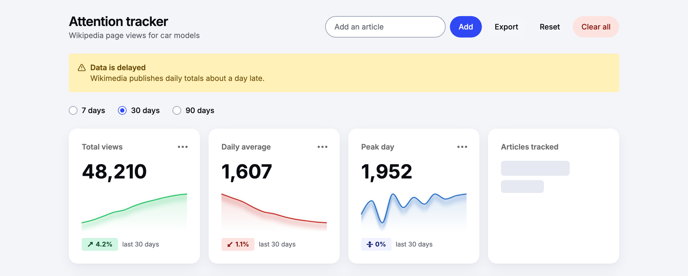

# Tally UI

[](https://github.com/han-sen/tally-ui/actions/workflows/ci.yml)

Tally UI is a small component library designed for building dashboards.

**[Browse the live Storybook](https://han-sen.github.io/tally-ui/)**, which includes a [full dashboard built from the components](https://han-sen.github.io/tally-ui/?path=/story/foundations-dashboard-preview--attention-tracker) and a [roadmap](https://han-sen.github.io/tally-ui/?path=/story/project-roadmap--roadmap).

[](https://han-sen.github.io/tally-ui/?path=/story/foundations-dashboard-preview--attention-tracker)

Built with React, TypeScript, Tailwind CSS v4, and class-variance-authority, documented and developed in Storybook. This is a work in progress: the generic components come first, then the dashboard-specific ones.

## Components

| Component     | Notes                                                                                                                                                            |
| ------------- | ---------------------------------------------------------------------------------------------------------------------------------------------------------------- |
| `Button`      | `primary`, `secondary`, `ghost`, `danger` variants, three sizes, loading state, ref forwarding                                                                   |
| `Tabs`        | Compound component (`Tabs.List`, `Tabs.Trigger`, `Tabs.Content`) with `tablist`/`tab`/`tabpanel` roles and `aria-selected`                                       |
| `Badge`       | Status variants for short labels                                                                                                                                 |
| `Alert`       | Compound component (`Alert.Title`, `Alert.Description`), status icon per variant, `alert` vs `status` role by severity                                           |
| `Card`        | Compound component (`Card.Header`, `Card.Title`, `Card.Description`, `Card.Content`, `Card.Footer`) on the surface tokens                                        |
| `StatCard`    | Headline number built on `Card` and `Badge`, with an optional change (`delta`) whose direction and sentiment are separate, and an `isLoading` state              |
| `Table`       | Semantic table parts (`Table.Header`, `Table.Body`, `Table.Row`, `Table.Head`, `Table.Cell`, `Table.Caption`) with a scrolling container and `numeric` alignment |
| `Skeleton`    | Single-shape loading placeholder sized with `className`, hidden from assistive tech, animated only when motion is allowed                                        |
| `EmptyState`  | Compound component (`EmptyState.Icon`, `.Title`, `.Description`, `.Actions`) for "no data" and "no results" views                                                |
| `Input`       | Styled native text field with a forwarded ref, styled from `disabled`, `readOnly`, and `aria-invalid` instead of variants                                        |
| `Sparkline`   | Tiny D3-scaled line chart with a gradient area fill, gaps for missing values, and an optional accessible `label`                                                 |
| `BarChart`    | D3-scaled bar chart with a y-axis, gridlines, thinned x labels, optional `formatValue`/`formatLabel`, and an accessible `label`                                  |
| `Combobox`    | Generic searchable select (WAI-ARIA combobox pattern) with keyboard support, filtering or async results, loading and empty states, controlled or uncontrolled    |
| `RadioGroup`  | One choice from a set, built on native radios, with option values inferred as a typed union                                                                      |
| `ProgressBar` | Labelled `progressbar` for shares and goals, in the chart colors, with `hideLabel`                                                                               |
| `Text`        | Body text on the type scale and text color tokens                                                                                                                |
| `Heading`     | `h1`–`h6` with the heading level kept separate from its visual size                                                                                              |

Planned: `LineChart`, `Legend`, a data-driven `DataTable` built on the `Table` parts, and `DescriptionList`. See the [roadmap](https://han-sen.github.io/tally-ui/?path=/story/project-roadmap--roadmap) for the full list. The charts use D3 only for scales and shape math and render the SVG with React, so they need no client-side DOM access.

## Using the library

The package is not published to npm yet. Build a tarball and install it, the same file npm would publish:

```bash
npm pack                      # builds dist/ and writes han-sen-tally-ui-0.1.0.tgz
npm install ../tally-ui/han-sen-tally-ui-0.1.0.tgz   # from your app
```

It needs `react` and `react-dom` (18.3 or 19) in your app, and ships ES modules with type declarations. Then pick one way to load the styles:

**Any app: one prebuilt stylesheet.** It contains Tailwind's base styles, the design tokens, and only the utilities the components use.

```ts
import '@han-sen/tally-ui/styles.css';
```

**Apps that already use Tailwind v4:** load just the tokens and let your own Tailwind generate the utilities from the package.

```css
@import 'tailwindcss';
@import '@han-sen/tally-ui/tokens.css';
@source '../node_modules/@han-sen/tally-ui/dist';
```

Fonts are not bundled. The tokens use `Inter Variable` and `JetBrains Mono Variable` with system fonts as the fallback, so load those fonts yourself (for example `@fontsource-variable/inter`) or override `--font-sans` and `--font-mono`.

```tsx
import { Button, StatCard, BarChart } from '@han-sen/tally-ui';
```

Components that use React state (`Tabs`, `Combobox`, and the `Card` actions menu) are marked `'use client'`, so they work in Next.js App Router pages.

## Getting started

```bash
npm install
npm run storybook   # component explorer at http://localhost:6006
npm test            # unit tests (Vitest + Testing Library), watch mode
npm run lint
npm run build       # type-check
npm run build:lib   # library build: dist/ with JS, type declarations, and CSS
```

## Design decisions

**Semantic design tokens.** Components use role-based classes such as `bg-tally-primary` and `text-tally-danger-fg`, never raw palette colors. The tokens live in `src/tokens.css`: Tailwind v4's `@theme inline` points at CSS variables defined in `:root`. Adding dark mode later means adding a `.dark` block of variable values, with no component changes.

**Prefixed tokens, so they never collide.** Every variable and theme key carries the `tally` prefix (`--tally-primary`, `bg-tally-primary`, `rounded-tally-control`). Generic names like `--primary` or `bg-primary` are what shadcn/ui and many apps define themselves, and sharing them would silently change one set of colors when both are loaded. `tokens.css` also leaves fonts alone, so importing it never replaces an app's own font. The fonts live in a separate `fonts.css` that only the prebuilt stylesheet and Storybook use.

**Glow is a token, not a prop.** Charts use a soft glow to lift a line off the surface, and `Sparkline` has a `glow` prop for it. Other components leave it out, but you can opt in with the `shadow-tally-glow` token and a shadow color class: `<Button className="shadow-tally-glow shadow-tally-primary/45">`. Tinted fills look best with `shadow-current/35`, which uses the element's text color.

**Variants with CVA.** Each element with variant logic gets its own `cva()` definition, kept in a separate `*.variants.ts` file so React Fast Refresh keeps working. Variant prop types are inferred from the definition rather than written by hand.

**Variants are visible in the DOM.** Components with a `variant` prop (`Button`, `Badge`, `Alert`) expose the resolved variant as `data-variant`, including the default when none is passed. Tests, consumer CSS, and debugging can rely on one predictable attribute instead of matching class names, and it isn't a test-only hook.

**Compound components where the structure calls for it.** `Tabs` shares its selected value through Context. `Alert.Title` and `Alert.Description` are plain styled elements, because they don't need shared state. Compound structure doesn't require Context.

**Props that behave like the native element.** Components extend the native HTML attributes, merge `className` with `cn()` (`clsx` + `tailwind-merge`, so a caller's `mt-0` wins over a default), and spread the remaining props. Semantic attributes such as `role` come after the spread so a caller can't accidentally override them.

**`forwardRef` on interactive elements** (`Button`, `Tabs.Trigger`), so consumers can focus or measure them and the library stays compatible with React versions before 19.

**No outer margins.** Components style their inside (padding, gap, color). The layout that contains them decides the space around them.

**Accessibility.** Tabs use the ARIA tabs roles. `Alert` uses `role="alert"` for warning and danger and `role="status"` otherwise. Status is conveyed by an icon and text as well as color, and decorative icons are `aria-hidden`. Loading states put `aria-busy` on the component and add visually hidden status text, while the skeleton shapes themselves are `aria-hidden`. The Storybook a11y addon runs axe checks on every story.

**Documentation as the API surface.** Props carry JSDoc (including usage notes and known caveats), which shows up in editor hovers and in Storybook's autodocs.

## Known limitations

- `Tabs` `defaultValue` must match a `Tabs.Trigger` and `Tabs.Content` value, but TypeScript can't verify that. A typo silently results in no active tab.
- `Tabs` doesn't yet support arrow-key navigation or roving `tabindex`.
- `Table`'s horizontal scroll container isn't keyboard-focusable on its own, so a wide table with no focusable content inside it can't be scrolled by keyboard.
- `Card.Title` renders a `div`, so it doesn't appear in the page outline unless the caller adds `role="heading"` and `aria-level`.
- `BarChart` exposes only its `label` to assistive tech. The per-bar tooltips are for mouse users, so a hidden data table is still to do. It assumes non-negative values and unique labels.
- `BarChart` draws in a fixed 600 by 300 coordinate space, so its text scales with the chart instead of measuring the container.
- Dark mode isn't implemented yet, and the status colors are provisional until more components exist.

## Testing

Unit tests use Vitest and Testing Library and cover behavior and accessibility (roles, `aria-selected`, prop passthrough, ref forwarding). `Tabs` also has a Storybook interaction test.
